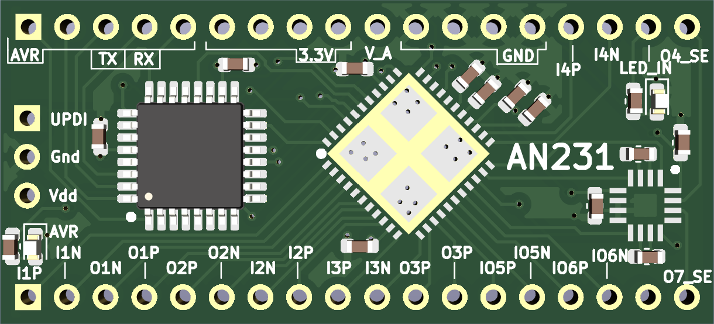

## FPAA dev board

In this project, I have designed a compact development board for the AN231.

The AN231 is a Field Programmable Analog Array (FPAA) based on a switched-capacitor architecture. It enables a programmable analog front-end in your design, allowing the same hardware to be repurposed for different analog signal processing tasks.

This project provides a simple, compact PCB that can be easily integrated into other designs. The board uses a standard form factor, and the I/O connections are kept as straightforward as possible to simplify prototyping and reuse.

